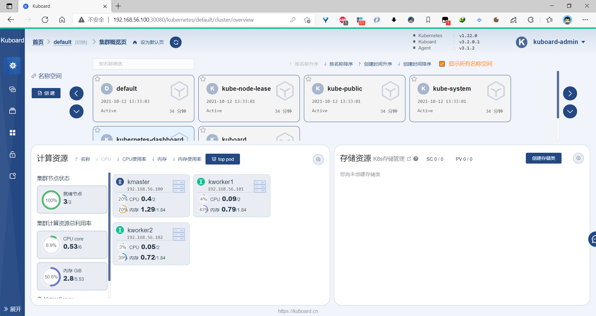
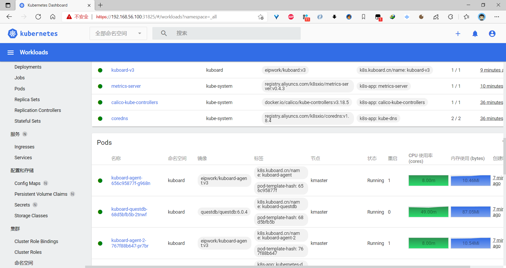
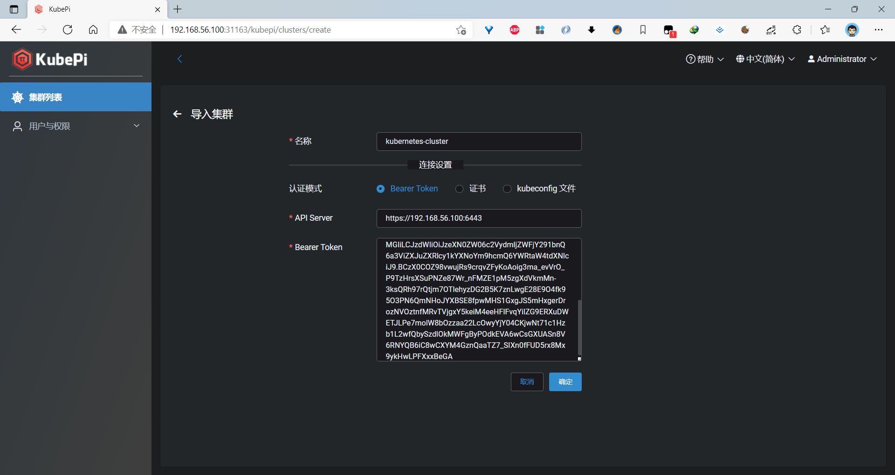
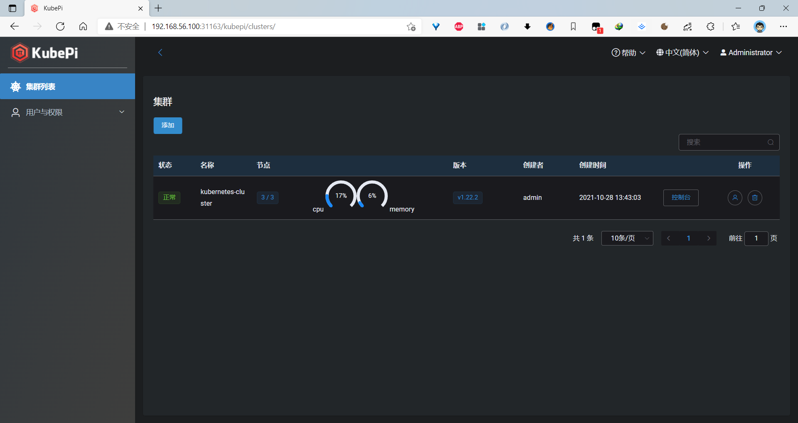
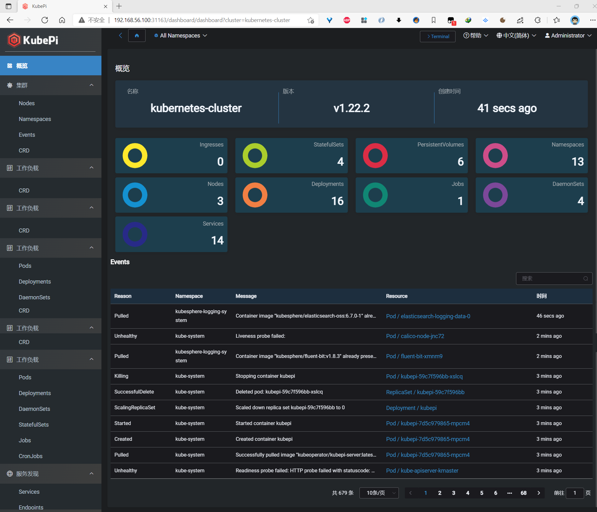
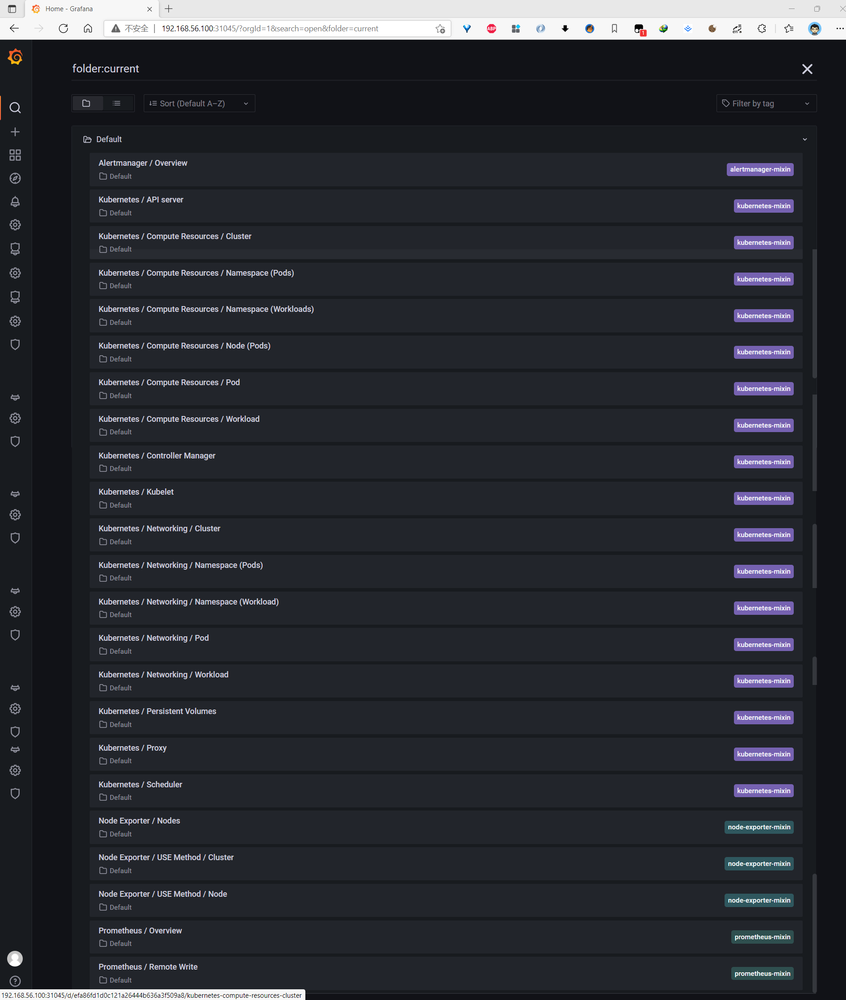
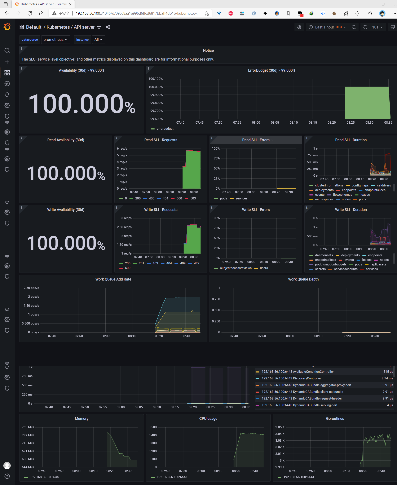
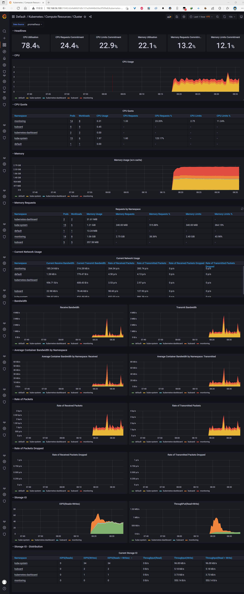
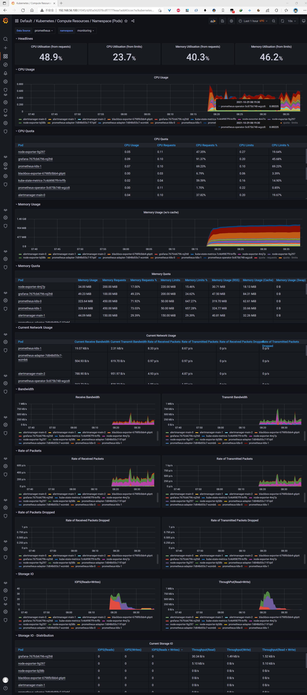
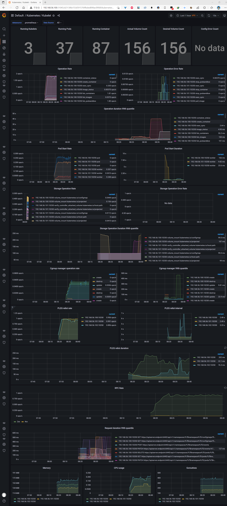

# vagrant-kubernetes-cluster

**_Vagrant一键安装Kubernetes集群。安装 Metrics Server 、Kuboard 、Kubernetes Dashboard、KubePi、Kubernetes集群监控prometheus-operator等。_**

**安装环境**：

- Vagrant 版本： 2.2.18
- VirtualBox 版本： 6.1.26

虚拟机网卡设置如图所示：


**CentOS7 环境安装版本**：

- Ubuntu 版本： centos7
- Containerd 版本： 1.4.11
- Kubernetes 版本： v1.22.2

**Ubuntu 环境安装版本**：

- Ubuntu 版本： 20.04.2 LTS
- Containerd 版本： 1.5.5
- Kubernetes 版本： v1.22.0

## 一键安装

```bash
vagrant up

Bringing machine 'kmaster' up with 'virtualbox' provider...
Bringing machine 'kworker1' up with 'virtualbox' provider...
Bringing machine 'kworker2' up with 'virtualbox' provider...
==> kmaster: Importing base box 'generic/ubuntu2004'...
==> kmaster: Matching MAC address for NAT networking...
==> kmaster: Setting the name of the VM: kmaster
==> kmaster: Clearing any previously set network interfaces...
==> kmaster: Preparing network interfaces based on configuration...
    kmaster: Adapter 1: nat
    kmaster: Adapter 2: hostonly
==> kmaster: Forwarding ports...
    kmaster: 22 (guest) => 2222 (host) (adapter 1)
==> kmaster: Running 'pre-boot' VM customizations...
==> kmaster: Booting VM...
==> kmaster: Waiting for machine to boot. This may take a few minutes...
    kmaster: SSH address: 127.0.0.1:2222
    kmaster: SSH username: vagrant
    kmaster: SSH auth method: private key
    kmaster:
    kmaster: Vagrant insecure key detected. Vagrant will automatically replace
    kmaster: this with a newly generated keypair for better security.
    kmaster:
    kmaster: Inserting generated public key within guest...
    kmaster: Removing insecure key from the guest if it's present...
    kmaster: Key inserted! Disconnecting and reconnecting using new SSH key...
==> kmaster: Machine booted and ready!
==> kmaster: Checking for guest additions in VM...
==> kmaster: Setting hostname...
==> kmaster: Configuring and enabling network interfaces...
==> kmaster: Mounting shared folders...
    kmaster: /vagrant => D:/Vagrant/kubernetes-cluster
==> kmaster: Running provisioner: shell...
    kmaster: Running: C:/Users/swfeng/AppData/Local/Temp/vagrant-shell20211012-49908-1qfj4jz.sh
    kmaster: [TASK 0] Setting TimeZone
    kmaster: [TASK 1] Setting DNS
    kmaster: [TASK 2] Setting Ubuntu System Mirrors
    kmaster: [TASK 3] Disable and turn off SWAP
    kmaster: [TASK 4] Stop and Disable firewall
    kmaster: [TASK 5] Enable and Load Kernel modules
    kmaster: [TASK 6] Add Kernel settings
    kmaster: [TASK 7] Install containerd runtime
    kmaster: [TASK 8] Add apt repo for kubernetes
    kmaster: Warning: apt-key output should not be parsed (stdout is not a terminal)
    kmaster: OK
    kmaster: [TASK 9] Install Kubernetes components (kubeadm, kubelet and kubectl)
    kmaster: [TASK 10] Enable ssh password authentication
    kmaster: [TASK 11] Set root password
    kmaster: [TASK 12] Update /etc/hosts file
==> kmaster: Running provisioner: shell...
    kmaster: Running: C:/Users/swfeng/AppData/Local/Temp/vagrant-shell20211012-49908-11nj6h4.sh
    kmaster: [TASK 1] Pull required containers
    kmaster: [TASK 2] Initialize Kubernetes Cluster
    kmaster: [TASK 3] Deploy Calico network
    kmaster: [TASK 4] Generate and save cluster join command to /joincluster.sh
==> kworker1: Importing base box 'generic/ubuntu2004'...
==> kworker1: Matching MAC address for NAT networking...
==> kworker1: Setting the name of the VM: kworker1
==> kworker1: Fixed port collision for 22 => 2222. Now on port 2200.
==> kworker1: Clearing any previously set network interfaces...
==> kworker1: Preparing network interfaces based on configuration...
    kworker1: Adapter 1: nat
    kworker1: Adapter 2: hostonly
==> kworker1: Forwarding ports...
    kworker1: 22 (guest) => 2200 (host) (adapter 1)
==> kworker1: Running 'pre-boot' VM customizations...
==> kworker1: Booting VM...
==> kworker1: Waiting for machine to boot. This may take a few minutes...
    kworker1: SSH address: 127.0.0.1:2200
    kworker1: SSH username: vagrant
    kworker1: SSH auth method: private key
    kworker1:
    kworker1: Vagrant insecure key detected. Vagrant will automatically replace
    kworker1: this with a newly generated keypair for better security.
    kworker1:
    kworker1: Inserting generated public key within guest...
    kworker1: Removing insecure key from the guest if it's present...
    kworker1: Key inserted! Disconnecting and reconnecting using new SSH key...
==> kworker1: Machine booted and ready!
==> kworker1: Checking for guest additions in VM...
==> kworker1: Setting hostname...
==> kworker1: Configuring and enabling network interfaces...
==> kworker1: Mounting shared folders...
    kworker1: /vagrant => D:/Vagrant/kubernetes-cluster
==> kworker1: Running provisioner: shell...
    kworker1: Running: C:/Users/swfeng/AppData/Local/Temp/vagrant-shell20211012-49908-6qmkd4.sh
    kworker1: [TASK 0] Setting TimeZone
    kworker1: [TASK 1] Setting DNS
    kworker1: [TASK 2] Setting Ubuntu System Mirrors
    kworker1: [TASK 3] Disable and turn off SWAP
    kworker1: [TASK 4] Stop and Disable firewall
    kworker1: [TASK 5] Enable and Load Kernel modules
    kworker1: [TASK 6] Add Kernel settings
    kworker1: [TASK 7] Install containerd runtime
    kworker1: [TASK 8] Add apt repo for kubernetes
    kworker1: Warning: apt-key output should not be parsed (stdout is not a terminal)
    kworker1: OK
    kworker1: [TASK 9] Install Kubernetes components (kubeadm, kubelet and kubectl)
    kworker1: [TASK 10] Enable ssh password authentication
    kworker1: [TASK 11] Set root password
    kworker1: [TASK 12] Update /etc/hosts file
==> kworker1: Running provisioner: shell...
    kworker1: Running: C:/Users/swfeng/AppData/Local/Temp/vagrant-shell20211012-49908-vmdbxa.sh
    kworker1: [TASK 1] Join node to Kubernetes Cluster
==> kworker2: Importing base box 'generic/ubuntu2004'...
==> kworker2: Matching MAC address for NAT networking...
==> kworker2: Setting the name of the VM: kworker2
==> kworker2: Fixed port collision for 22 => 2222. Now on port 2201.
==> kworker2: Clearing any previously set network interfaces...
==> kworker2: Preparing network interfaces based on configuration...
    kworker2: Adapter 1: nat
    kworker2: Adapter 2: hostonly
==> kworker2: Forwarding ports...
    kworker2: 22 (guest) => 2201 (host) (adapter 1)
==> kworker2: Running 'pre-boot' VM customizations...
==> kworker2: Booting VM...
==> kworker2: Waiting for machine to boot. This may take a few minutes...
    kworker2: SSH address: 127.0.0.1:2201
    kworker2: SSH username: vagrant
    kworker2: SSH auth method: private key
    kworker2:
    kworker2: Vagrant insecure key detected. Vagrant will automatically replace
    kworker2: this with a newly generated keypair for better security.
    kworker2:
    kworker2: Inserting generated public key within guest...
    kworker2: Removing insecure key from the guest if it's present...
    kworker2: Key inserted! Disconnecting and reconnecting using new SSH key...
==> kworker2: Machine booted and ready!
==> kworker2: Checking for guest additions in VM...
==> kworker2: Setting hostname...
==> kworker2: Configuring and enabling network interfaces...
==> kworker2: Mounting shared folders...
    kworker2: /vagrant => D:/Vagrant/kubernetes-cluster
==> kworker2: Running provisioner: shell...
    kworker2: Running: C:/Users/swfeng/AppData/Local/Temp/vagrant-shell20211012-49908-1s6ys4c.sh
    kworker2: [TASK 0] Setting TimeZone
    kworker2: [TASK 1] Setting DNS
    kworker2: [TASK 2] Setting Ubuntu System Mirrors
    kworker2: [TASK 3] Disable and turn off SWAP
    kworker2: [TASK 4] Stop and Disable firewall
    kworker2: [TASK 5] Enable and Load Kernel modules
    kworker2: [TASK 6] Add Kernel settings
    kworker2: [TASK 7] Install containerd runtime
    kworker2: [TASK 8] Add apt repo for kubernetes
    kworker2: Warning: apt-key output should not be parsed (stdout is not a terminal)
    kworker2: OK
    kworker2: [TASK 9] Install Kubernetes components (kubeadm, kubelet and kubectl)
    kworker2: [TASK 10] Enable ssh password authentication
    kworker2: [TASK 11] Set root password
    kworker2: [TASK 12] Update /etc/hosts file
==> kworker2: Running provisioner: shell...
    kworker2: Running: C:/Users/swfeng/AppData/Local/Temp/vagrant-shell20211012-49908-1qxwo1n.sh
    kworker2: [TASK 1] Join node to Kubernetes Cluster
```

> 安装后三台机器的 IP 为：

|  机器名  |       IP       |
| :------: | :------------: |
| kmaster  | 192.168.56.100 |
| kworker1 | 192.168.56.101 |
| kworker2 | 192.168.56.102 |

> `root`用户密码为`kubeadmin`

## 配置.kube/config

```bash
root@kmaster:~# mkdir -p $HOME/.kube
root@kmaster:~# sudo cp -i /etc/kubernetes/admin.conf $HOME/.kube/config
root@kmaster:~# sudo chown $(id -u):$(id -g) $HOME/.kube/config
```

集群状态：

```bash
root@kmaster:~# kubectl cluster-info
Kubernetes control plane is running at https://kmaster.k8s.com:6443
CoreDNS is running at https://kmaster.k8s.com:6443/api/v1/namespaces/kube-system/services/kube-dns:dns/proxy
```

```bash
root@kmaster:~# kubectl get node,po,svc -A -owide

Every 2.0s: kubectl get node,po,svc -A -owide                                                                                                             kmaster: Tue Oct 12 13:53:57 2021

NAME            STATUS   ROLES                  AGE     VERSION   INTERNAL-IP      EXTERNAL-IP   OS-IMAGE             KERNEL-VERSION     CONTAINER-RUNTIME
node/kmaster    Ready    control-plane,master   20m     v1.22.0   192.168.56.100   <none>        Ubuntu 20.04.2 LTS   5.4.0-77-generic   containerd://1.5.5
node/kworker1   Ready    <none>                 9m40s   v1.22.0   192.168.56.101   <none>        Ubuntu 20.04.2 LTS   5.4.0-77-generic   containerd://1.5.5
node/kworker2   Ready    <none>                 7m35s   v1.22.0   192.168.56.102   <none>        Ubuntu 20.04.2 LTS   5.4.0-77-generic   containerd://1.5.5

NAMESPACE     NAME                                           READY   STATUS    RESTARTS   AGE     IP               NODE       NOMINATED NODE   READINESS GATES
kube-system   pod/calico-kube-controllers-7659fb8886-dwvc4   1/1     Running   0          20m     192.168.189.2    kmaster    <none>           <none>
kube-system   pod/calico-node-2w8x5                          1/1     Running   0          20m     192.168.56.100   kmaster    <none>           <none>
kube-system   pod/calico-node-vqjsc                          1/1     Running   0          7m35s   192.168.56.102   kworker2   <none>           <none>
kube-system   pod/calico-node-zj98h                          1/1     Running   0          9m40s   192.168.56.101   kworker1   <none>           <none>
kube-system   pod/coredns-7568f67dbd-4jssz                   1/1     Running   0          20m     192.168.189.3    kmaster    <none>           <none>
kube-system   pod/coredns-7568f67dbd-vn8ph                   1/1     Running   0          20m     192.168.189.1    kmaster    <none>           <none>
kube-system   pod/etcd-kmaster                               1/1     Running   0          20m     192.168.56.100   kmaster    <none>           <none>
kube-system   pod/kube-apiserver-kmaster                     1/1     Running   0          20m     192.168.56.100   kmaster    <none>           <none>
kube-system   pod/kube-controller-manager-kmaster            1/1     Running   0          20m     192.168.56.100   kmaster    <none>           <none>
kube-system   pod/kube-proxy-2sqmm                           1/1     Running   0          7m35s   192.168.56.102   kworker2   <none>           <none>
kube-system   pod/kube-proxy-8z758                           1/1     Running   0          20m     192.168.56.100   kmaster    <none>           <none>
kube-system   pod/kube-proxy-brgl8                           1/1     Running   0          9m40s   192.168.56.101   kworker1   <none>           <none>
kube-system   pod/kube-scheduler-kmaster                     1/1     Running   0          20m     192.168.56.100   kmaster    <none>           <none>

NAMESPACE     NAME                 TYPE        CLUSTER-IP   EXTERNAL-IP   PORT(S)                  AGE   SELECTOR
default       service/kubernetes   ClusterIP   10.96.0.1    <none>        443/TCP                  20m   <none>
kube-system   service/kube-dns     ClusterIP   10.96.0.10   <none>        53/UDP,53/TCP,9153/TCP   20m   k8s-app=kube-dns
```

## 安装 metrics-server

```bash
root@kmaster:/vagrant/metrics# kubectl apply -f metrics.yaml
serviceaccount/metrics-server created
clusterrole.rbac.authorization.k8s.io/system:aggregated-metrics-reader created
clusterrole.rbac.authorization.k8s.io/system:metrics-server created
rolebinding.rbac.authorization.k8s.io/metrics-server-auth-reader created
clusterrolebinding.rbac.authorization.k8s.io/metrics-server:system:auth-delegator created
clusterrolebinding.rbac.authorization.k8s.io/system:metrics-server created
service/metrics-server created
deployment.apps/metrics-server created
apiservice.apiregistration.k8s.io/v1beta1.metrics.k8s.io created
```

## 安装 kuboard

```bash
root@kmaster:~# kubectl apply -f https://addons.kuboard.cn/kuboard/kuboard-v3.yaml
namespace/kuboard created
configmap/kuboard-v3-config created
serviceaccount/kuboard-boostrap created
clusterrolebinding.rbac.authorization.k8s.io/kuboard-boostrap-crb created
daemonset.apps/kuboard-etcd created
deployment.apps/kuboard-v3 created
service/kuboard-v3 created

```

访问 kuboard http://192.168.56.100:30080

> 用户名： admin
> 密码： Kuboard123



## 安装 kubernetes-dashboard

```bash

root@kmaster:/vagrant/kubernetes-dashboard# kubectl apply -f kubernetes-dashboard.yaml
namespace/kubernetes-dashboard created
serviceaccount/kubernetes-dashboard created
service/kubernetes-dashboard created
secret/kubernetes-dashboard-certs created
secret/kubernetes-dashboard-csrf created
secret/kubernetes-dashboard-key-holder created
configmap/kubernetes-dashboard-settings created
role.rbac.authorization.k8s.io/kubernetes-dashboard created
clusterrole.rbac.authorization.k8s.io/kubernetes-dashboard created
rolebinding.rbac.authorization.k8s.io/kubernetes-dashboard created
clusterrolebinding.rbac.authorization.k8s.io/kubernetes-dashboard created
deployment.apps/kubernetes-dashboard created
service/dashboard-metrics-scraper created
Warning: spec.template.metadata.annotations[seccomp.security.alpha.kubernetes.io/pod]: deprecated since v1.19; use the "seccompProfile" field instead
deployment.apps/dashboard-metrics-scraper created
serviceaccount/admin-user created
clusterrolebinding.rbac.authorization.k8s.io/admin-user created

# 执行下面命令后手动将type: ClusterIP 改为 type: NodePort
root@kmaster:~# kubectl edit svc kubernetes-dashboard -n kubernetes-dashboard

# 查看svc，放行端口
root@kmaster:~# kubectl get svc -A |grep kubernetes-dashboard

kubernetes-dashboard   dashboard-metrics-scraper   ClusterIP   10.111.109.182   <none>        8000/TCP                                       2m53s
kubernetes-dashboard   kubernetes-dashboard        NodePort    10.97.250.165    <none>        443:31825/TCP                                  2m53s


# 获取访问令牌
root@kmaster:~# kubectl -n kubernetes-dashboard get secret $(kubectl -n kubernetes-dashboard get sa/admin-user -o jsonpath="{.secrets[0].name}") -o go-template="{{.data.token | base64decode}}"

eyJhbGciOiJSUzI1NiIsImtpZCI6Ik9BODl1TGtTRjUzWUl4dnJKUHdpYnB1V0RIZGpxNkxoT2VMWEEzNW1yVk0ifQ.eyJpc3MiOiJrdWJlcm5ldGVzL3NlcnZpY2VhY2NvdW50Iiwia3ViZXJuZXRlcy5pby9zZXJ2aWNlYWNjb3VudC9uYW1lc3BhY2UiOiJrdWJlcm5ldGVzLWRhc2hib2FyZCIsImt1YmVybmV0ZXMuaW8vc2VydmljZWFjY291bnQvc2VjcmV0Lm5hbWUiOiJhZG1pbi11c2VyLXRva2VuLXdtN3hqIiwia3ViZXJuZXRlcy5pby9zZXJ2aWNlYWNjb3VudC9zZXJ2aWNlLWFjY291bnQubmFtZSI6ImFkbWluLXVzZXIiLCJrdWJlcm5ldGVzLmlvL3NlcnZpY2VhY2NvdW50L3NlcnZpY2UtYWNjb3VudC51aWQiOiIzNzAzOGNhZC1jYjE2LTQ3ZjAtYTIxZS1hODNlNjhjYjA4ZGMiLCJzdWIiOiJzeXN0ZW06c2VydmljZWFjY291bnQ6a3ViZXJuZXRlcy1kYXNoYm9hcmQ6YWRtaW4tdXNlciJ9.iPxLZnueJz9y2ngFTtgEuZ36Ae0QLK2oFXEBXinYcsM5712_sw3iyYODB9Eyu9AzscMDin-jL4ssctl6dQt-3PD6vdrLjSWAlDNK_PXXYlnFCTehrcFjZNGWv3yM7e5dfUOqmrl0ROwYEKFtF93sQAYPtXHZUqDnQOQ15VE-NVd7RyCgHHNtCiV_UeDrRg7M0YBvPtL24w35MaaKyeLIs_YWZpNgjV3zNfdl86Lo3SEoU0_nVAqwZzBroUxrE6ekBDGisWvQ6NtrEZLRTgk2izPCUiT3XOj4bENwf3Ba1bCKGvIzmWx41KIVdNamN_c1YOiY1HL__1ryKwMad4JR-w
```

访问 kubernetes-dashboard https://192.168.56.100:31825



## 集群概况

```bash
Every 2.0s: kubectl get node,po,svc -A -owide                                                                                                             kmaster: Tue Oct 12 14:08:09 2021

NAME            STATUS   ROLES                  AGE   VERSION   INTERNAL-IP      EXTERNAL-IP   OS-IMAGE             KERNEL-VERSION     CONTAINER-RUNTIME
node/kmaster    Ready    control-plane,master   35m   v1.22.0   192.168.56.100   <none>        Ubuntu 20.04.2 LTS   5.4.0-77-generic   containerd://1.5.5
node/kworker1   Ready    <none>                 23m   v1.22.0   192.168.56.101   <none>        Ubuntu 20.04.2 LTS   5.4.0-77-generic   containerd://1.5.5
node/kworker2   Ready    <none>                 21m   v1.22.0   192.168.56.102   <none>        Ubuntu 20.04.2 LTS   5.4.0-77-generic   containerd://1.5.5

NAMESPACE              NAME                                             READY   STATUS    RESTARTS        AGE     IP               NODE       NOMINATED NODE   READINESS GATES
kube-system            pod/calico-kube-controllers-7659fb8886-dwvc4     1/1     Running   0               34m     192.168.189.2    kmaster    <none>           <none>
kube-system            pod/calico-node-2w8x5                            1/1     Running   0               34m     192.168.56.100   kmaster    <none>           <none>
kube-system            pod/calico-node-vqjsc                            1/1     Running   0               21m     192.168.56.102   kworker2   <none>           <none>
kube-system            pod/calico-node-zj98h                            1/1     Running   0               23m     192.168.56.101   kworker1   <none>           <none>
kube-system            pod/coredns-7568f67dbd-4jssz                     1/1     Running   0               34m     192.168.189.3    kmaster    <none>           <none>
kube-system            pod/coredns-7568f67dbd-vn8ph                     1/1     Running   0               34m     192.168.189.1    kmaster    <none>           <none>
kube-system            pod/etcd-kmaster                                 1/1     Running   0               34m     192.168.56.100   kmaster    <none>           <none>
kube-system            pod/kube-apiserver-kmaster                       1/1     Running   0               35m     192.168.56.100   kmaster    <none>           <none>
kube-system            pod/kube-controller-manager-kmaster              1/1     Running   0               34m     192.168.56.100   kmaster    <none>           <none>
kube-system            pod/kube-proxy-2sqmm                             1/1     Running   0               21m     192.168.56.102   kworker2   <none>           <none>
kube-system            pod/kube-proxy-8z758                             1/1     Running   0               34m     192.168.56.100   kmaster    <none>           <none>
kube-system            pod/kube-proxy-brgl8                             1/1     Running   0               23m     192.168.56.101   kworker1   <none>           <none>
kube-system            pod/kube-scheduler-kmaster                       1/1     Running   0               35m     192.168.56.100   kmaster    <none>           <none>
kube-system            pod/metrics-server-9577d976b-xzrgt               1/1     Running   0               9m27s   192.168.41.129   kworker1   <none>           <none>
kubernetes-dashboard   pod/dashboard-metrics-scraper-856586f554-kdgtw   1/1     Running   0               6m57s   192.168.41.130   kworker1   <none>           <none>
kubernetes-dashboard   pod/kubernetes-dashboard-67484c44f6-lbp5l        1/1     Running   0               6m57s   192.168.77.129   kworker2   <none>           <none>
kuboard                pod/kuboard-agent-2-767f88b647-pr7br             1/1     Running   1 (5m57s ago)   6m26s   192.168.189.5    kmaster    <none>           <none>
kuboard                pod/kuboard-agent-656c95877f-g968n               1/1     Running   1 (5m37s ago)   6m26s   192.168.189.6    kmaster    <none>           <none>
kuboard                pod/kuboard-etcd-th9nq                           1/1     Running   0               8m39s   192.168.56.100   kmaster    <none>           <none>
kuboard                pod/kuboard-questdb-68d5bfb5b-2tnwf              1/1     Running   0               6m26s   192.168.189.7    kmaster    <none>           <none>
kuboard                pod/kuboard-v3-5fc46b5557-44hlj                  1/1     Running   0               8m39s   192.168.189.4    kmaster    <none>           <none>
```

## 安装KubePi

https://kubeoperator.io/docs/kubepi/install/

```bash
kubectl apply -f https://raw.githubusercontent.com/KubeOperator/KubePi/master/docs/deploy/kubectl/kubepi.yaml
```

获取访问地址

```bash
# 获取 NodeIp
export NODE_IP=$(kubectl get nodes -o jsonpath="{.items[0].status.addresses[0].address}")

# 获取 NodePort
export NODE_PORT=$(kubectl -n kube-system get services kubepi -o jsonpath="{.spec.ports[0].nodePort}")

# 获取 Address
echo http://$NODE_IP:$NODE_PORT
```

登录

```
地址: http://$NODE_IP:$NODE_PORT
用户名: admin
密码: kubepi
```

导入集群，获取token

```bash
kubectl -n kubernetes-dashboard get secret $(kubectl -n kubernetes-dashboard get sa/admin-user -o jsonpath="{.secrets[0].name}") -o go-template="{{.data.token | base64decode}}"
```







---

**以下环境需要调整虚拟机配置，至少需4核8G内存**

## 安装KubeSphere

### 安装KubeSphere前置环境

安装nfs文件系统

#### 安装nfs-server

```bash
# 在每个机器。
yum install -y nfs-utils

# 在kmaster 执行以下命令 192.168.56.100
echo "/nfs/data/ *(insecure,rw,sync,no_root_squash)" > /etc/exports

# 执行以下命令，启动 nfs 服务;创建共享目录
mkdir -p /nfs/data

# 在master执行
systemctl enable rpcbind
systemctl enable nfs-server
systemctl start rpcbind
systemctl start nfs-server

# 使配置生效
exportfs -r

#检查配置是否生效
exportfs
```

#### 配置nfs-client

```bash
showmount -e 192.168.56.100
mkdir -p /nfs/data
mount -t nfs 192.168.56.100:/nfs/data /nfs/data
```

#### 配置默认存储

配置动态供应的默认存储类

```yaml
## 创建了一个存储类
apiVersion: storage.k8s.io/v1
kind: StorageClass
metadata:
  name: nfs-storage
  annotations:
    storageclass.kubernetes.io/is-default-class: "true"
provisioner: k8s-sigs.io/nfs-subdir-external-provisioner
parameters:
  archiveOnDelete: "true"  ## 删除pv的时候，pv的内容是否要备份

---
apiVersion: apps/v1
kind: Deployment
metadata:
  name: nfs-client-provisioner
  labels:
    app: nfs-client-provisioner
  # replace with namespace where provisioner is deployed
  namespace: default
spec:
  replicas: 1
  strategy:
    type: Recreate
  selector:
    matchLabels:
      app: nfs-client-provisioner
  template:
    metadata:
      labels:
        app: nfs-client-provisioner
    spec:
      serviceAccountName: nfs-client-provisioner
      containers:
        - name: nfs-client-provisioner
          image: docker.io/v5cn/nfs-subdir-external-provisioner:v4.0.2
          # resources:
          #    limits:
          #      cpu: 10m
          #    requests:
          #      cpu: 10m
          volumeMounts:
            - name: nfs-client-root
              mountPath: /persistentvolumes
          env:
            - name: PROVISIONER_NAME
              value: k8s-sigs.io/nfs-subdir-external-provisioner
            - name: NFS_SERVER
              value: 192.168.56.100 ## 指定自己nfs服务器地址
            - name: NFS_PATH  
              value: /nfs/data  ## nfs服务器共享的目录
      volumes:
        - name: nfs-client-root
          nfs:
            server: 192.168.56.100
            path: /nfs/data
---
apiVersion: v1
kind: ServiceAccount
metadata:
  name: nfs-client-provisioner
  # replace with namespace where provisioner is deployed
  namespace: default
---
kind: ClusterRole
apiVersion: rbac.authorization.k8s.io/v1
metadata:
  name: nfs-client-provisioner-runner
rules:
  - apiGroups: [""]
    resources: ["nodes"]
    verbs: ["get", "list", "watch"]
  - apiGroups: [""]
    resources: ["persistentvolumes"]
    verbs: ["get", "list", "watch", "create", "delete"]
  - apiGroups: [""]
    resources: ["persistentvolumeclaims"]
    verbs: ["get", "list", "watch", "update"]
  - apiGroups: ["storage.k8s.io"]
    resources: ["storageclasses"]
    verbs: ["get", "list", "watch"]
  - apiGroups: [""]
    resources: ["events"]
    verbs: ["create", "update", "patch"]
---
kind: ClusterRoleBinding
apiVersion: rbac.authorization.k8s.io/v1
metadata:
  name: run-nfs-client-provisioner
subjects:
  - kind: ServiceAccount
    name: nfs-client-provisioner
    # replace with namespace where provisioner is deployed
    namespace: default
roleRef:
  kind: ClusterRole
  name: nfs-client-provisioner-runner
  apiGroup: rbac.authorization.k8s.io
---
kind: Role
apiVersion: rbac.authorization.k8s.io/v1
metadata:
  name: leader-locking-nfs-client-provisioner
  # replace with namespace where provisioner is deployed
  namespace: default
rules:
  - apiGroups: [""]
    resources: ["endpoints"]
    verbs: ["get", "list", "watch", "create", "update", "patch"]
---
kind: RoleBinding
apiVersion: rbac.authorization.k8s.io/v1
metadata:
  name: leader-locking-nfs-client-provisioner
  # replace with namespace where provisioner is deployed
  namespace: default
subjects:
  - kind: ServiceAccount
    name: nfs-client-provisioner
    # replace with namespace where provisioner is deployed
    namespace: default
roleRef:
  kind: Role
  name: leader-locking-nfs-client-provisioner
  apiGroup: rbac.authorization.k8s.io
```

#### 确认配置是否生效

```bash
kubectl get sc
```


### 安装KubeSphere

*KubeSphere目前还不支持kubernetes 1.22,这部分内容稍后就来...*


## 安装Kubernetes集群监控prometheus-operator


### 查看集群信息

```bash
kubectl cluster-info
```

### 克隆prometheus-operator

```bash
git clone https://github.com/prometheus-operator/kube-prometheus.git
cd kube-prometheus
```

### 创建namespace, CustomResourceDefinitions & operator pod

> 因为原配置里面的好多镜拉取不下来，因此应用修改过的配置文件(当前目录下的kube-prometheus)

```bash
kubectl apply -f manifests/setup
```

### 查看namespace

```bash
kubectl get ns monitoring
```

### 查看pod

```bash
kubectl get pods -n monitoring
```

### 应用部署配置文件

```bash
kubectl apply -f manifests/
```

### 查看pods,svc

```bash
kubectl get pods,svc -n monitoring
```

### 调整SVC访问方式

Prometheus:

```bash
kubectl --namespace monitoring patch svc prometheus-k8s -p '{"spec": {"type": "NodePort"}}'
```

Alertmanager:

```bash
kubectl --namespace monitoring patch svc alertmanager-main -p '{"spec": {"type": "NodePort"}}'
```

Grafana:

```bash
kubectl --namespace monitoring patch svc grafana -p '{"spec": {"type": "NodePort"}}'
```

### 查看端口

```bash
$ kubectl -n monitoring get svc  | grep NodePort
alertmanager-main       NodePort    10.96.212.116   <none>        9093:30496/TCP,8080:30519/TCP   7m53s
grafana                 NodePort    10.96.216.187   <none>        3000:31045/TCP                  7m50s
prometheus-k8s          NodePort    10.96.180.95    <none>        9090:30253/TCP,8080:30023/TCP   7m44s
```

访问 Grafana Dashboard

http://192.168.56.100:31045

```
Username: admin
Password: admin
```












访问 Prometheus Dashboard 

http://192.168.56.100:30253


访问 Alert Manager Dashboard 

http://192.168.56.100:30496


### 销毁prometheus-operator监控服务

```bash
kubectl delete --ignore-not-found=true -f manifests/ -f manifests/setup
```

https://computingforgeeks.com/setup-prometheus-and-grafana-on-kubernetes
